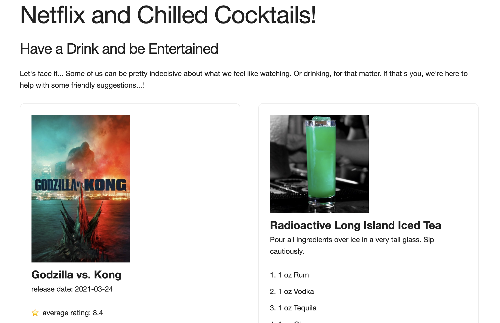

# Project One | Team Three - project (netflix and chilled cocktails)

## Description

This project demonstrates the use of event listeners, local storage, multiple external api requests, and direct DOM manipulation. A team project, everyone came together to bring disparate pieces together to generate this app.

## Demo
https://darrindevs.github.io/netflix-and-chilled-cocktails

## Uses
HTML/CSS/JS

## Librarys
Skeleton css, Parsley ...maybe @john?

## External APIs
thecocktaildb.com, api.themoviedb.org

## Screenshot

